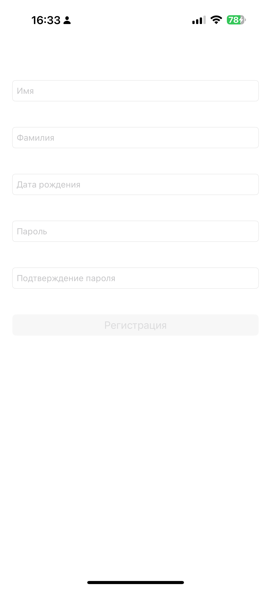
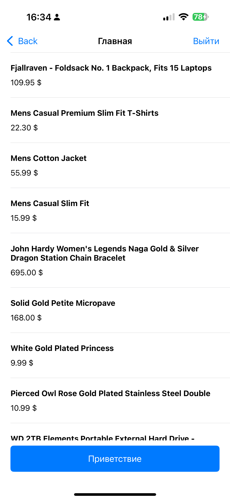
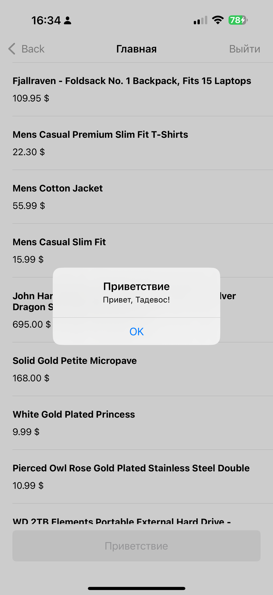

# 📱 Регистрация + список (тестовое задание iOS)

## 🔹 Описание  
Приложение на **Swift + UIKit**, реализованное по архитектуре **MVVM**.  
Состоит из двух экранов:  
1. **Регистрация** — ввод имени, фамилии, даты рождения, пароля и подтверждения пароля.  
2. **Главный экран** — список товаров с API + кнопка «Приветствие».  

---

## 🔹 Скриншоты  

  
  
  
  

---

## 🔹 Реализовано  

✅ Экран регистрации с валидацией данных:  
- имя и фамилия не короче 2 символов;  
- пароль ≥ 8 символов, совпадает с подтверждением;  
- дата рождения выбирается через `UIDatePicker`;  
- кнопка «Регистрация» активна только при корректных данных;  
- ошибки отображаются через `UIAlertController`;  
- поля паролей скрывают ввод (`isSecureTextEntry`).  

✅ Экран со списком (главный экран):  
- загрузка данных из [FakeStoreAPI](https://fakestoreapi.com/products);  
- отображение названия и цены товаров;  
- индикатор загрузки в header таблицы;  
- кастомная ячейка `ProductCell`;  
- кнопка «Приветствие» с именем пользователя;  
- кнопка «Выйти» сбрасывает данные и возвращает на экран регистрации;  
- ячейки таблицы автоматически снимают выделение после нажатия.  

✅ Дополнительно:  
- сохранение «сессии» в `UserDefaults`: повторный запуск открывает сразу главный экран;  
- локализация `UIDatePicker` под системный язык;  
- скрытие клавиатуры по тапу.  

---

## 🔹 Используемый стек
- Swift  
- UIKit  
- MVVM  
- URLSession для сетевых запросов  
- UserDefaults для хранения имени пользователя и состояния регистрации  
